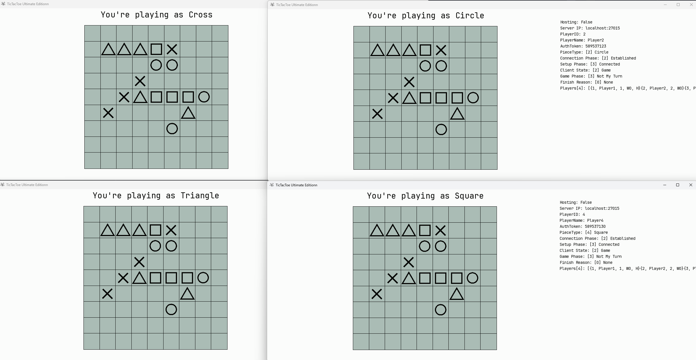
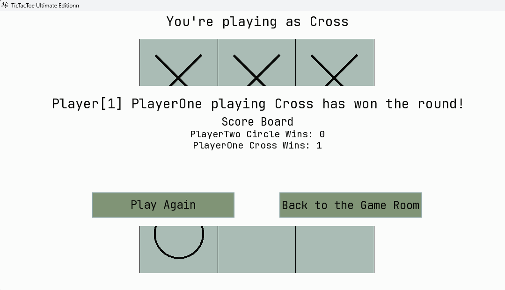

# TicTacToeOverLan
1. [Overview](#overview)
2. [Idea](#idea)
3. [Implementation analysis](#implementation-analysis)
4. [User manual](#user-manual)
5. [Developer guide](#developer-guide)

## Overview
TicTacToeOverLan allows for up to 6 simultaneous players connected over the network.
With port forwarding It should be possible to play over the internet.
Custom board settings allow for a board of size 32x32 with custom win condition length.



---

## Idea
The general idea is inspired by how minecraft handles it's worlds.
We should have an option to launch an Internal Server by one of the Clients.
Others would connect to it via a specified IP and port, or a url.
The state of the game should be held and validated on the server.
Board updates are going to be sent packaged with the whole board, 
as it's pretty small and shouldn't pose any performance concerns.
The host should be the one managing the board settings, and requesting game starts and restarts.

### Networking
The connections are going to be handled by WebSockets. 
The Windows api already contains methods for handling multiple connections at a time, making it quick to set up.
Sadly that means, this implementation won't work on linux systems.
A custom network protocol needs to be designed, so the server and client know what data is being transmitted and how to handle it.

### State Management
The server should be the sole authoritative entity in the design.
It should hold, manage and update the game state based on validated data, which arrives in the form of packets from the clients.
The game state(board state) is going to be sent whole, to the clients for rendering and synchronization on each update.
This doesn't pose any performance concerns on this scale.

After each move the server validates the move and checks if it's a winning one.
Sending `boardStateUpdate`'s or `gameEnd` packets accordingly.
The win condition is check by ray-casting in all directions from the last move and counting same pieces,
if they equal or exceed the `winConditionLength` the server sends out `gameEnd` packets, finishing the round.

### Client Rendering
I chose SFML library for the GUI. It's simple enough, while giving the necessary tools to create a small working GUI application.
It comes with built-in functions for shapes, text and event handling, but lacks any widget functionality.
That means, implementing my own widgets for buttons, text fields and the board itself. I plan to use the minecraft widget implementation as the blueprint, while cutting out unnecessary parts.
All widgets would implement the `Widget` interface, which would contain methods like update, handleInput and render. Which is going to simplify the general usage in the game loop.
Each widget is going to have a dedicated builder for ease of use.
To declutter the render and update functions, each widget is going to get a displayCondition lambda, to know when and where to show up on screen.
Button press or input events are going to launch callbacks for processing.

### Binary Bundling
The project should work as a standalone binary, which is going to require bundling all libraries statically inside, as well as the images and fonts.
Unfortunately, this is going to overly bloat the size of the binary.

---

## Implementation analysis

The final application follows a Client-Server architecture, even when playing locally.
The project was implemented using C++26, using SFML for graphics and Winsock2 for networking.

### Architecture & Concurrency
- **Host-as-Server**: We avoid a dedicated binary. Instead, when a player chooses to "Host", the `GameClient` spins up an `InternalGameServer` on a dedicated `std::thread`. Additionally, the current implementation allows for creating a Dedicated server easily, if desired.
- **Thread Safety**: Since the server runs in parallel to the rendering loop, shared resources and state management utilize `std::atomic` variables and `std::mutex` locks to prevent race conditions. Mainly used in debug logging, game ticks and within `RollingAverage`.
- **Game Loop**: The client operates on a standard *Input* → *Update* → *Render* loop, while the server maintains its own tick rate to process incoming packets and broadcast state updates.

### Networking Protocol

Contrary to the initial WebSocket idea, I went for Raw TCP Sockets to better understand how webservers work, also standard WebSockets were a bit overkill for a project like this.
The implementation utilizes the Windows Sockets API (Winsock2).
- **Binary Protocol**: Communication relies on a custom binary protocol. Data is structured into `Packets` defined with `#pragma pack(1)` to ensure byte-perfect alignment across different architectures.
- **Packet Handling**:
  - **Header-Payload Separation**: Every transmission is prefixed with a PacketHeader (containing `PacketType` and `size`), allowing the receiver to determine exactly how many bytes to read next.
  - **Stream Fragmentation**: The `NetworkManager` has a buffering system (`recieveBuffer`) to handle fragmented TCP packets, ensuring that partial packets are stored until the full payload arrives.
- **Serialization**: The dynamic `std::vector` board state is "flattened" into static 1D arrays using `Utils::serializeBoard` for network transmission, then reconstructed into 2D vectors upon arrival.

### Custom GUI System

SFML provides the window and drawing primitives(shapes and text), but lacks high-level components, like buttons or text fields. A custom Widget System was implemented to handle that.
- **Unified**: All UI elements(`ButtonWidget`, `TextFieldWidget`) inherit from an abstract `Widget` base class, enforcing a contract for handleEvent, update and render methods.
- **Builder Pattern**: To reduce boilerplate in the initialization phase and improve the developer experience, widgets use the **Builder Pattern** (`ButtonBuilder`, `TextFieldBuilder`). This allows chaining method calls (e.g. `ButtonWidget.builder().setPosition().setSize().build())`) for readable UI creation.
- **Callbacks**: UI logic is decupled from game logic using `std::function` lambdas. Widgets trigger callbacks (e.g. `onClick`, `onTextChange`) rather than handling game state directly.

### Game Logic And State Management
- **Authoritative State**: The server holds the "True" state of the board. Clients send `MoverRequestPacket`'s, which the server validates before applying.
- **Snapshot Synchronization**: To ensure total consistency, the server broadcasts the *entire* board state (`BoardStateUpdatePacket`) after every valid move. This eliminates "desync" issues where a client might miss a single move packet.
- **Win Validator**: Victory detection uses an optimized **Directional Ray-casting** algorithm (`WinValidator`). Instead of scanning the whole board (O(N^2)), it scans only the axes originating from the last placed piece, making the check efficient even on larger board sizes(up to 32x32).

### Debug Info
To help with testing and state verification, a real-time Debug Overlay was implemented into the rendering loop. Toggled via the `F3` key, this bypasses the standard widget system and prints raw telemetry data directly onto the screen.
- **Client Section**: It displays local state variables, and the local view of the player list.
- **Internal Server Section**: When the client is acting as the Host, the overlay additionally renders a section for the `InternalGameServer`. Displays servers status, tick count, `RollingAverage` tick times and the authoritative game settings. Which allows to verify the data and its synchronization, between the client's local state and the server's without attaching an external debugger. 

---

## User Manual

### Prerequisites
Before compiling, ensure you have the following tools installed and added to PATH.
1. **CMake**
   - Version 4 or newer 
2. **Compiler of your choice**
   - Since the project uses **C++26**, a very recent version is required (GCC 14 or newer)
   - For development MinGW-w64-15.2.0 was used. Acquired from (https://www.mingw-w64.org/downloads/#mingw-w64-builds) (https://github.com/niXman/mingw-builds-binaries/releases)
3. **Git**
   - Required by CMake to automatically download SFML.

### Compilation
Optionally the binary can be grabbed from the releases tab in the GitHub repo: https://github.com/Bebomny/TicTacToeOverLan/releases

1. Clone the project
    ```
    git clone https://github.com/Bebomny/TicTacToeOverLan.git 
    ```
2. Navigate into the directory and tell CMake to use MinGW as the compiler instead of looking for Visual Studio
    ```
    mkdir build
    cd build
    cmake -G "MinGW Makefiles" ..
    ```

3. Compile. This may take a minute as CMake needs to compile SFML and WinApi.
    ```
    cmake --build .
    ```

### Launching the Game
After a successful build, the executable will be generated in the `build/` folder (or a subfolder inside `build`)
As the images and fonts are bundled inside the binary, you're free to move it around, and It should still function as usual.

To launch it either double-click the executable, or launch it from the terminal:
```
.\TicTacToeOverLan.exe
```

### Playing the Game
The game is played in sessions. One player acts as the Host (Server), and others join as Clients.

#### Main Menu
Upon launching, you will see the Main Menu.
- **Player name**: Here you can set the name of your player.
- **Server Address**: The address of the server to which you'd like to connect to. Can be a url or an IP address, the port by default is `27015`
- **Connect Button**: Connects to the server at which address has been specified, needs to be a valid address in the form of `{ip/url}:{port}`
- **Host button**: Clicking the host button, starts an internal server on the port specified in the address bar, by default `27015`. The server starts on the IP of the host machine. So Its reachable on the host via `localhost`, on LAN via the machines local IP, and over the broader internet if the port is forwarded through the router.


### Game Room
Once connected, players gather in the Game Room.
- **PlayerList**: Here you can see all connected players and their pieces.

  
- **Game Settings (Host Only)**: The Host has exclusive control over the match rules:
  - **Board Size**: Adjust the grid size (from 1x1 up to 32x32).
  - **Win Condition**: Set how many consecutive pieces are needed to win (e.g. 3, 4, 5).
  - *Tip*: For larger boards (20x20), a win condition of 5 is recommended.
  
  
- **Starting**: 
  - Once all players are gathered, the Host can start the game with the "Start" button.


### Gameplay
The game is turn-based.
- **Your Turn**: 
  - When it is your turn, your cursor will be able to interact with the board.
  - Left-Click on an empty square to place your piece. You can see the piece you are playing as at the top of your screen.
  - Once placed, your move is sent to the server, and the turn passes to the next player.
  
  
- **Opponent's Turn**:
  - You cannot place pieces. Wait for the other player to make their move, and for the server to broadcast the change.
- **Winning**:
  - The game ends immediately when a player aligns the required number of pieces horizontally, vertically, or diagonally.
  - A "Game End" screen will appear announcing the winner, and the current scores for the lobby.
  - The Host can then choose to start another match or return to the **Game Room**, returning to the game room resets the leaderboard.
  
  

---

## Developer Guide

### UI
All widgets should implement the widget interface, and provide builder methods for ease of use.
In the `GameClient` widgets are placed in a map, for retrieval by name, if necessary later.
If it can be done, the condition for displaying and activating a widget should go into the displayCondition callback.

The board for now has a separate handler than widgets. If necessary It can be made a widget later on.


### GameClient
Widgets are created in the initWidget function at the start of the application. Ideally this should be made into a screen system, but for a simple game like this it wasn't necessary.
UI elements are put into position using preestablished `sf::Vector2f` and `sf::FloatRect` structures.

The client follows a *handleInput* → *update* → *render* loop. Each screen should have their own handle, update and render functions for readability. A screen system would improve this dramatically when considering expansion or refactoring of the project

The constructor establishes initial values, loads fonts and icons, creates the screen in a contract with SFML and the creates widgets in the `initWidgets` function.

Then the client runs in the `run` function calling `handleInput`, `update` and `render` functions in order.
The loop runs on 60 updates per second, as per the window framerate set in the constructor.

<br>

#### Input Handling
Here we poll all events that came in on this frame, first we check for the Window Close Event, then for global keyboard events such as the debug `F3` being pressed. Next is distributing events to all widgets, and finally handling non widget events in separate functions for each screen(`handleMenuInput`, `handleGameRoomInput`, `handleGameInput`).

`HandleGameInput` is also responsible for sending move requests upon the players turn, as the gameBoard isn't a widget its checked here separately.

#### Updating
The update function is responsible for handling widget updates, animations, and received packets.
Firstly it updates all widgets, then proceeds to loop over all incoming packets, polling the `NetworkManager` for available full packets.

Then according to the packet header, it handles the data.
For readability most packets got their own functions, instead of handling them directly in the switch statement.
S2C Packets:
- `SERVER_HELLO`: Packet received from the server upon initial connection. We receive the playerID here, and then send `SETUP_REQ` with the confirmed ID, player name, initialToken, and whether we are the host.
- `SETUP_ACK`: Server accepted our `SETUP_REQ` and responded with the generated AuthToken, player's pieceType, and the initial Board settings. We also receive the players currently residing in the lobby.
- `NEW_PLAYER_JOIN`: When a new player joins we receive this packet, it contains all info about the new player that the client is allowed to know like: `playerName`, `pieceType`, `isMe`, `isMyTurn`, current `wins`, and whether it's the `host`.
- `SETTINGS_UPDATE`: The host changed the board settings, we receive the new parameters here.
- `PLAYER_DISCONNECTED`: Received when a player disconnects, we just erase the corresponding player form the player list.
- `GAME_START`: `GameStartPacket` also contains all board settings for a final confirmation as well as the starting player, and initialGameBoard. We set this all up for the game, and switch the client into `ClientState::Game`.
- `BOARD_STATE_UPDATE`: We deserialize the new board state, update the turn and round parameters, switching the acting player, and refreshing the player list.
- `BACK_TO_GAME_ROOM`: This is sent when the Host chose to return to the Game Room, so the clients can update their state and screens accordingly.
- `GAME_END`: This packet is received upon either a player winning or disconnecting. Finishing the current round. The host can then choose to return to the Game Room or play again.

#### Rendering
We clear the background, then render each menu's text, or other things in the separate screen functions.
The widgets are rendered on top of the text. The debug menu is drawn on the absolute top of the screen, ensuring its always visible.

Text is rendered mostly by reusing one text object, this minimizes font loading calls, and maybe marginally improves performance.

#### Server Address Parsing
A RegEx pattern is used for server address and port parsing, it checks if its valid and separates the ip/url and port into 2 capturing groups.
```regexp
^((?:\D+).\w{2,8}|(?:\b(?:(?:25[0-5]|2[0-4][0-9]|[01]?[0-9][0-9]?)\.){3}(?:25[0-5]|2[0-4][0-9]|[01]?[0-9][0-9]?))):(\d{1,5}\b)$
```
**Examples:**
- 192.168.2.32:27015 → **valid** → Group 1: 192.168.2.32 Group 2: 27015
- domain.example.com:27015 → **valid** → Group 1: domain.example.com Group 2: 27015
- 129.212.913.123:12312 → **invalid**
- localhost:27015 → **valid** → Group 1: localhost Group 2: 27015

#### Internal Server Handling
- `startInternalServerThread`: Grabs the port from the server address field using the above parsing regex, and launches a new thread with the internal server.
- `stopInternalServerThread`: Called either by pressing the HOST button in the main menu again after launching the server, or in the destructor of the GameClient, to ensure that no zombie orphaned threads are left behind.
    

### Internal Game Server
The `start` function initializes default values, the initial board state and available pieces.
Creates a listing socket on the specified port and spins up a while loop for polling the Windows api for packets, initial timeout is set to 10ms between polls. 
Should be made dynamic later to keep a constant TPS value instead of trying to reach the 10ms interval.

When a new connection arrives, the server creates a new ClientContext for the incoming connection and sends a `SERVER_HELLO` packet with the generated playerID.
C2S Packets:
- `SETUP_REQ`: Received after the server sends the initial Hello. The server reads the client's preferred name and `initialToken`. It then generates an `AuthToken`, assigns a `PieceType` from the available pool, adds the client to the player list and responds with SETUP_ACK.
- `SETTINGS_CHANGE_REQ`: **(Host Only)** If validated, it updates the internal `BoardData` and broadcasts a `SETTINGS_UPDATE` packet to all clients.
- `GAME_START_REQ`: **(Host Only)** The server resets the game board, assigns the starting player, zeros out the move history, and broadcasts a `GAME_START` packet containing the clear grid and final game settings.
- `MOVE_REQ`: The core gameplay packet. The server validate that:
  - It is actually this player's turn.
  - The target square is currently empty.
  
  If valid, the server updates the `BoardData`, appends the move to history, checks for win condition using `WinValidator`, and then broadcasts a `BOARD_STATE_UPDATE` or `GAME_END` packet if a win is detected.
- `BACK_TO_GAME_ROOM`: **(Host Only)** Received when the game is over and the host wants to return to the lobby. Relayed to all clients.

The server additionally exposes multiple functions visible to the hosting game client containing telemetry data: `getTick`, `getLastTickTime`, `getAvgTickTime`, `getServerPort`, `getCurrentTurn`, `getHostingPlayerId`, `getNextPlayerId`, `getBoardSettings`, `getAvailablePieces`, `getPlayers` and `getMoves`.

### Rolling Average
A custom implementation of a rolling average to track `tick` times on the `InternalGameServer`. 
Utilizes mutexes for thread safe access, and comes with `min`, `max` and `avg` methods built in.
A deque is used for the values with a limited number of entries.

### Game Definitions
Contains definitions for common objects between the client and server. Like `PieceType`, `Player`, `BoardData`, `BoardSquare` or `Move` structs.

### Network Protocol
All packet are defined in this file, it also utilizes the `#pragma pack(push, 1)` macro. This prevents the compiler from messing up the padding in the structs making the network protocol work on most architectures.

### common/resources Directory
Hold the Game Icon as well as the font in byte array form. This makes moving the binary around much easier as there is no need to bundle the resource folder along with it.